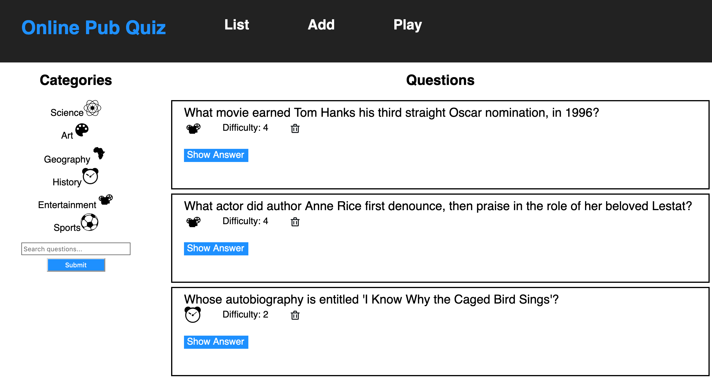

# Trivia Web App API
## Udacity Full Stack Web Development Nanodegree - Project #2

## Project Structure
This project consists of a React frontend that consumes the trivia app data provided from the Flask server.
The `./frontend` and `./backend` directories contain their own complete README files for these respective parts of this project.

## Contributing Authors
C. Tyler Dennis  
Udacity
## Licensing
This project is released under the [MIT License](https://opensource.org/licenses/MIT)
